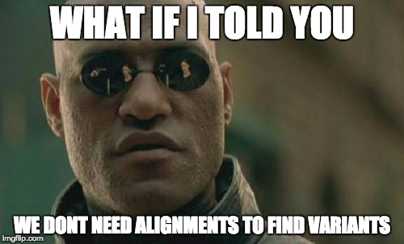

|kevlar build status| |Test coverage| |MIT licensed|

kevlar
======

Welcome to **kevlar**, software for variant discovery independent of a reference genome!

Where can I find kevlar online?
-------------------------------

The online home for kevlar is https://github.com/dib-lab/kevlar.
This includes a source code repository, stable version releases, an issue tracker, and various developer tools.
Documentation for kevlar can be found at https://kevlar.readthedocs.io.

If you have questions or need help with kevlar, the `GitHub issue tracker <https://github.com/dib-lab/kevlar>`__ should be your first point of contact.

How do I use kevlar?
--------------------

See kevlar's `installation instructions <http://kevlar.readthedocs.io/en/latest/install.html>`__ and `quick start guide <http://kevlar.readthedocs.io/en/latest/quick-start.html>`__ to learn how to use kevlar.

**Note**: Although a reference genome is not required, it can be utilized to reduce data volume at an early stage in the workflow and reduce the computational demands of subsequent steps.

**Another note**: kevlar development is currently focused almost entirely on finding novel variants in family-based trio and quad experimental designs.
However, the method lends itself easily to more general experimental designs, which will get more attention and support in the near future.

Contributing
------------

We welcome contributions to kevlar from the community!
If you're interested in modifying kevlar or contributing to its ongoing development feel free to send us a message or submit a pull request!.

The kevlar software is a project of the `Lab for Data Intensive Biology <http://ivory.idyll.org/lab/>`__ at UC Davis.

.. |kevlar build status| image:: https://img.shields.io/travis/dib-lab/kevlar.svg
   :target: https://travis-ci.org/dib-lab/kevlar
.. |Test coverage| image:: https://img.shields.io/codecov/c/github/dib-lab/kevlar.svg
   :target: https://codecov.io/github/dib-lab/kevlar
.. |MIT licensed| image:: https://img.shields.io/badge/license-MIT-blue.svg
   :target: https://github.com/dib-lab/kevlar/blob/master/LICENSE
